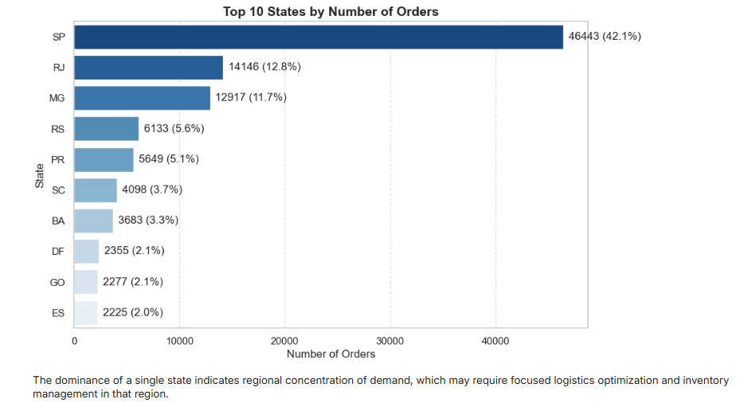
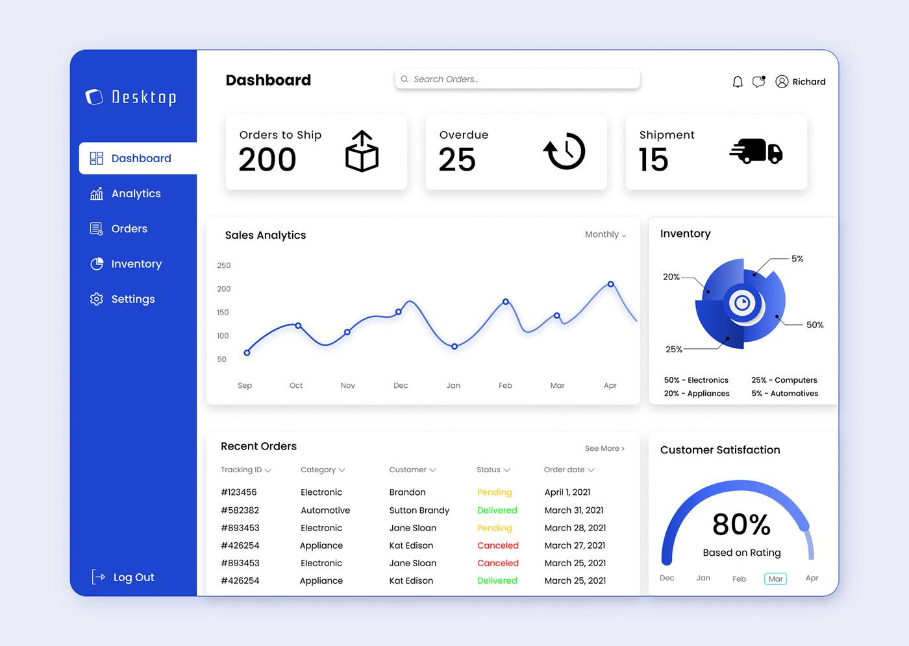
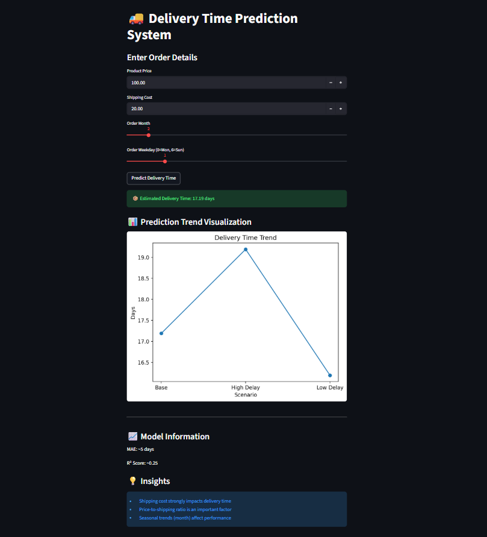

# 📦 Supply Chain & Delivery Performance Analysis

## 📌 Project Overview

This project performs an end-to-end analysis of supply chain operations using the Olist e-commerce dataset. It focuses on delivery performance, customer satisfaction, and identifying key logistics inefficiencies that impact business operations.

## 🎯 Objectives

* Analyze order and delivery trends
* Identify delayed deliveries and their contributing factors
* Build a machine learning model to predict delivery time
* Develop interactive dashboards for business decision-making

## 🛠️ Tools & Technologies

* Python (Pandas, NumPy, Matplotlib)
* SQL (MySQL)
* Power BI
* Machine Learning (Random Forest)
* Streamlit (for deployment)

## 📊 Key Features

* Data cleaning and preprocessing
* Exploratory Data Analysis (EDA)
* KPI creation using SQL views
* Interactive Power BI dashboard
* Delivery time prediction using machine learning

## 📂 Project Structure

* `data/` → cleaned dataset
* `notebooks/` → EDA and ML notebooks
* `sql/` → KPI queries
* `powerbi/` → dashboard file
* `models/` → trained ML model
* `assets/` → dashboard screenshots

## 📥 Dataset Source

The dataset used in this project is the Olist E-commerce Dataset, publicly available on Kaggle.

🔗 https://www.kaggle.com/datasets/olistbr/brazilian-ecommerce

**Note:** Only a cleaned dataset is included in this repository to keep it lightweight.

## 🤖 Machine Learning

A Random Forest regression model is used to predict delivery time based on features such as order date, seller information, and customer location.

## ⚠️ Limitations

* Missing critical features such as warehouse location, product availability, and geolocation distance
* No data on delivery priority or logistics partners
* Model relies on historical patterns rather than real-time operational data

## 🚀 Future Improvements

* Integrate geospatial data for accurate distance calculation
* Include logistics and inventory-level data
* Improve model performance using advanced algorithms (e.g., XGBoost)
* Enhance dashboard storytelling with actionable business insights

## 📷 Dashboard Preview

### 📊 Exploratory Data Analysis

This visualization shows key trends and patterns identified during the EDA phase.

---

### 📈 Power BI Dashboard

Interactive dashboard showcasing KPIs, delivery performance, and regional insights.

---

### 🤖 Delivery Time Prediction (Streamlit App)

Web application demonstrating real-time delivery time prediction using the trained machine learning model.

## 📌 Conclusion

This project provides valuable insights into delivery performance and highlights key operational gaps in supply chain processes. It demonstrates how data analytics and machine learning can be used to improve logistics efficiency and customer experience.
